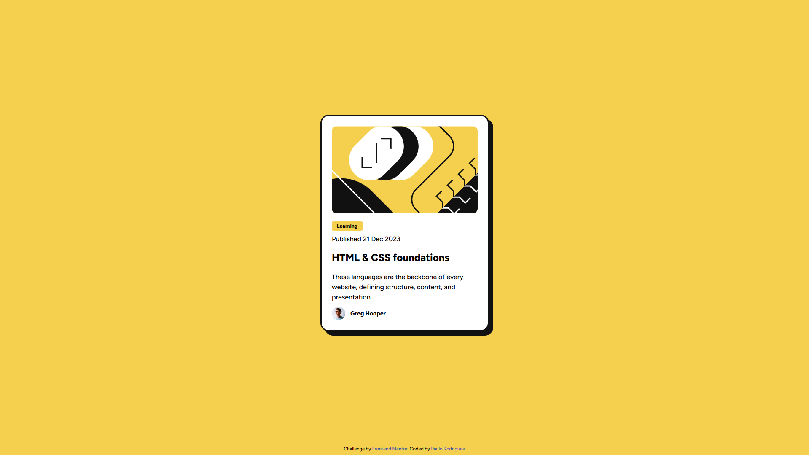
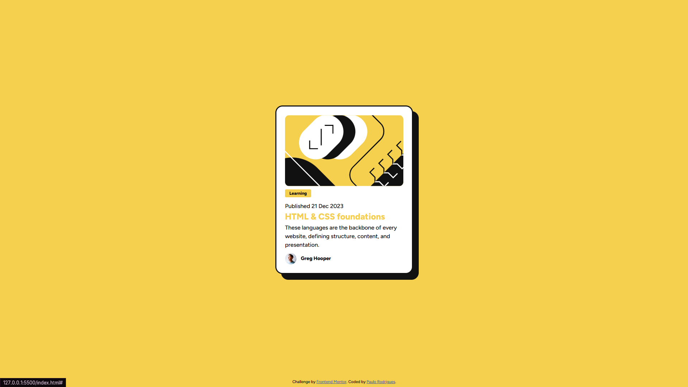
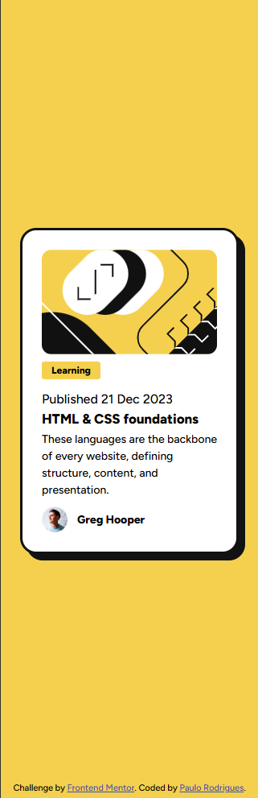

# Frontend Mentor - Blog Preview Card

This is my solution to the [Blog preview card challenge on Frontend Mentor](https://www.frontendmentor.io/learning-paths/getting-started-on-frontend-mentor-XJhRWRREZd/challenge/65e6f48617e502f0b6ca3d00/start). Frontend Mentor challenges help ypu improve your coding skills by building realistic projects using HTML, CSS and JavaScript.

## 🚀 Live Demo

You can view the deployed version of this project here:
👉 **[Live Site URL](https://paulofm-r.github.io/blog-preview-card/)**

---

## 📋 Table of Contents
- [Overview](#-overview)
    - [The Challenge](#the-challenge)
    - [Screenshot](#screenshot)
- [My Process](#screenshot)
    - [Built With](#built-with)
    - [What I Learned](#what-i-learned)
- [Author](#-author)

---

## 🔍 Overview

### The Challenge

Users should be able to:
- Se the optimal layout depending on their device's screen size (Mobile and Desktop).
- See hover and focus states for all interactive elements on the page (such as the card title).

### Screenshot
#### Desktop


#### Desktop - Hover link


#### Mobile


---

## 🛠️ My Process

### Built With

- **HTML5** - Semantic markup for better accessibility.
- **CSS3** - Custom properties (`:roor`), flexbox layout and responsiveness.
- **Mobile-First Workflow** - Ensuring a smooth, fluid design across all devices.

### What I Learned
This project was excellent for consolidating my responsive web design fundamentals. During development, I focused on:
1. **Semantic HTML:** Improving accessibility by swapping generic tags for structural elements.
2. **Fluid Layouts:** Utilizing `max-width`and `height: auto` instead of fixed dimensions, preventing the card from breaking on smaller screens.
3. **CSS Organization:** Practical usage of CSS variables to manage the challenge's color palette cleanly.

Here is an example of how I structured the card to be fully responsive:
```cs
.card {
    width: 100%;
    max-width: 327px;
    height: auto;
    border: 3px solid var(--color-gray950);
    border-radius: 20px;
    box-shadow: 8px 8px 0px 0px var(--color-gray950);
    background-color: white;
    padding: 24px;
}

@media (min-width: 768px) {
    .card {
        max-width: 384px;
        box-shadow: 16px 16px 0px 0px var(--color-gray950);
    }
}
```

## Author
- GitHub: [Paulofm-R](https://github.com/Paulofm-R)
- Frontend Mentor: [Paulofm-R](https://www.frontendmentor.io/profile/Paulofm-R)
